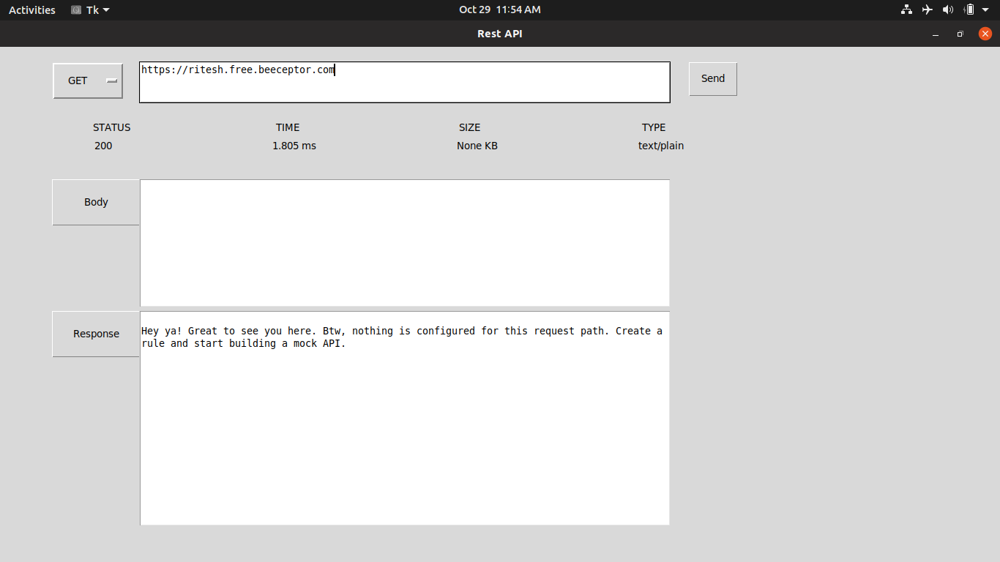
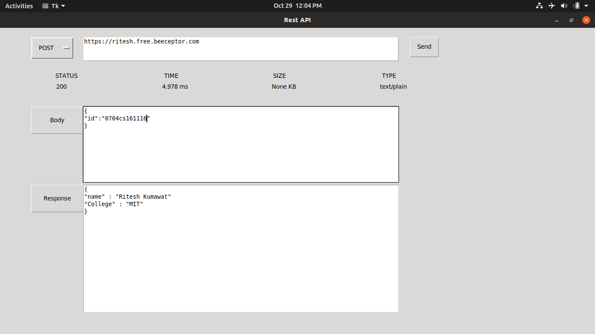

# RestApi
REST API stands for Representational State Transfer Application Programming Interface in Python.
A RESTful API is an application program interface (API) that uses HTTP requests to GET, PUT, POST and DELETE data. Representational State Transfer (REST) is a software architectural style that defines a set of constraints to be used for creating web services.

Following is the screenshots of the project .

1. Get Request -

2. Post Request -

